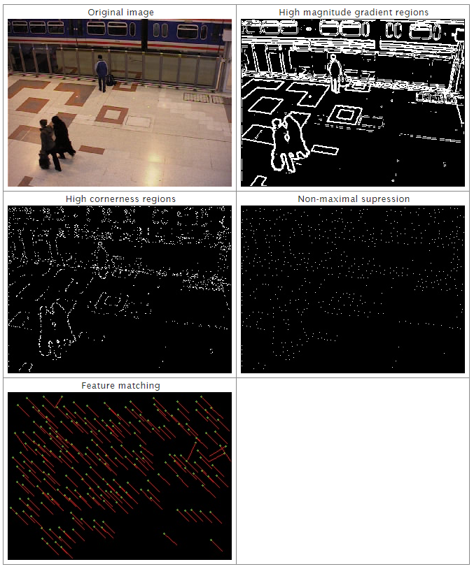

# FFME (Fast Feature Motion Estimation)
- Based on paper: Motion estimation through efficient matching of a reduced number of reliable singular points, 2008. [[Link]](http://oa.upm.es/3802/1/INVE_MEM_2008_57317.pdf)
- Description: real time motion estimation algorithm based on features.

